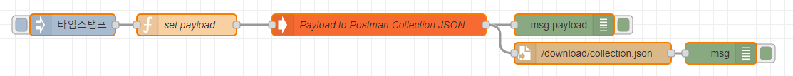

Payload to Postman Collection JSON NodeRED Node
=====================

Install
-------

`npm install node-red-contrib-postman`


Example 
-------



```javascript
msg = {};
msg.payload = [];

msg.payload[0] = {
         id: 'set-utc-time-now',
         name: 'Set the current time in UTC',
         description: 'Set the current time in UTC',
         request: {
             url:'{{apiBaseUrl}}/utc/settime',
             method: 'Post',
             body:{
                 mode: 'formdata',
                 formdata: [
                    {
                     key: 'nation',
                     value: 'ko-kr',
                     description : 'nation code'
                    },
                    {
                     key: 'nation2',
                     value: 'ko-kr',
                    }
                ]
             }
         }
}

msg.payload[1] = {
         id: 'get-utc-time-now',
         name: 'Get the current time in UTC',
         description: 'Get the current time in UTC',
         request: '{{apiBaseUrl}}/utc/now?a=a'
}
 
return msg;
```

<a href="https://www.buymeacoffee.com/gagagiga" target="_blank"></a>


Result 
-------
```json
{
  "item": [
    {
      "id": "set-utc-time-now",
      "name": "Set the current time in UTC",
      "description": {
        "content": "Set the current time in UTC",
        "type": "text/plain"
      },
      "request": {
        "url": {
          "path": [
            "utc",
            "settime"
          ],
          "host": [
            "{{apiBaseUrl}}"
          ],
          "query": [],
          "variable": []
        },
        "method": "POST",
        "body": {
          "mode": "formdata",
          "formdata": [
            {
              "description": {
                "content": "nation code",
                "type": "text/plain"
              },
              "key": "nation",
              "value": "ko-kr"
            },
            {
              "key": "nation2",
              "value": "ko-kr"
            }
          ]
        }
      },
      "response": [],
      "event": []
    },
    {
      "id": "get-utc-time-now",
      "name": "Get the current time in UTC",
      "description": {
        "content": "Get the current time in UTC",
        "type": "text/plain"
      },
      "request": {
        "url": {
          "path": [
            "utc",
            "now"
          ],
          "host": [
            "{{apiBaseUrl}}"
          ],
          "query": [
            {
              "key": "a",
              "value": "a"
            }
          ],
          "variable": []
        },
        "method": "GET"
      },
      "response": [],
      "event": []
    }
  ],
  "event": [],
  "variable": [
    {
      "id": "apiBaseUrl",
      "type": "string",
      "value": "http://localhost"
    }
  ],
  "info": {
    "_postman_id": "69dc1833-3b1a-4ab0-a1e5-94c8201cecd1",
    "name": "xmysql collection",
    "version": {
      "raw": "0.0.1",
      "major": 0,
      "minor": 0,
      "patch": 1,
      "prerelease": [],
      "build": [],
      "string": "0.0.1"
    },
    "schema": "https://schema.getpostman.com/json/collection/v2.1.0/collection.json"
  }
}
```

Flow Sample
-------
```json

[{"id":"9e496dd1.0d35a","type":"inject","z":"b541d855.b457b8","name":"","props":[{"p":"payload"},{"p":"topic","vt":"str"}],"repeat":"","crontab":"","once":false,"onceDelay":0.1,"topic":"","payload":"","payloadType":"date","x":120,"y":40,"wires":[["353f9c1b.6e6a84"]]},{"id":"353f9c1b.6e6a84","type":"function","z":"b541d855.b457b8","name":"set payload","func":"msg = {};\nmsg.payload = [];\n\nmsg.payload[0] = {\n         id: 'set-utc-time-now',\n         name: 'Set the current time in UTC',\n         description: 'Set the current time in UTC',\n         request: {\n             url:'{{apiBaseUrl}}/utc/settime',\n             method: 'Post',\n             body:{\n                 mode: 'formdata',\n                 formdata: [\n                    {\n                     key: 'nation',\n                     value: 'ko-kr',\n                     description : 'nation code'\n                    },\n                    {\n                     key: 'nation2',\n                     value: 'ko-kr',\n                    }\n                ]\n             }\n         }\n}\n\nmsg.payload[1] = {\n         id: 'get-utc-time-now',\n         name: 'Get the current time in UTC',\n         description: 'Get the current time in UTC',\n         request: '{{apiBaseUrl}}/utc/now?a=a'\n}\n \nreturn msg;","outputs":1,"noerr":0,"initialize":"","finalize":"","x":280,"y":40,"wires":[["d78f90f9.d042e"]]},{"id":"995c6264.bc2fd","type":"debug","z":"b541d855.b457b8","name":"","active":true,"tosidebar":true,"console":false,"tostatus":false,"complete":"false","statusVal":"","statusType":"auto","x":810,"y":40,"wires":[]},{"id":"1711ed77.cd7843","type":"file","z":"b541d855.b457b8","name":"","filename":"/download/collection.json","appendNewline":true,"createDir":true,"overwriteFile":"true","encoding":"none","x":850,"y":80,"wires":[["b6bd246c.fe1248"]]},{"id":"b6bd246c.fe1248","type":"debug","z":"b541d855.b457b8","name":"","active":true,"tosidebar":true,"console":false,"tostatus":false,"complete":"true","targetType":"full","statusVal":"","statusType":"auto","x":1030,"y":80,"wires":[]},{"id":"d78f90f9.d042e","type":"postman","z":"b541d855.b457b8","name":"Payload to Postman Collection JSON","apiBaseUrl":"http://localhost","collectionName":"xmysql collection","version":"0.0.1","x":550,"y":40,"wires":[["995c6264.bc2fd","1711ed77.cd7843"]]}]

```
